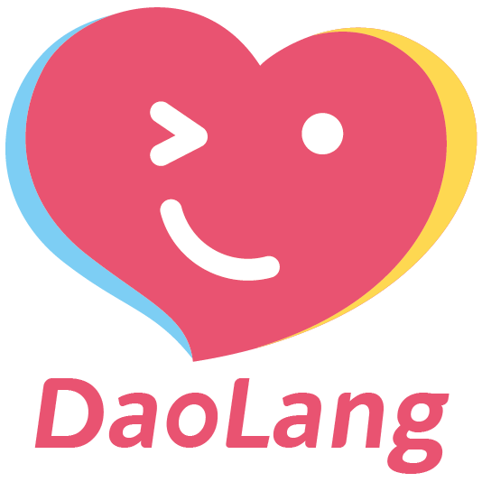

<p align="center">
    
</p>
<h3 align="center">.Net客户端程序多语言国际化管理框架，减少多语言相关开发工作的复杂度。</h3>
<p align="center">
	<a href="https://github.com/laosanyuan/DaoLang/blob/master/LICENSE">
		
	</a>
    <a>
        
    </a>
    <a>
        
    </a>
</p>

## 简介

通过使用.Net5开始引入的新特性[Source Genenrators](https://learn.microsoft.com/en-us/dotnet/csharp/roslyn-sdk/source-generators-overview)，用户可以通过解析器在开发阶段对代码进行检查和生成。Source Generators所生成的临时代码可以参与项目代码的编译，与本地代码在使用上一致。即，用户可与使用本地工程代码一样的方式使用临时代码。基于这种特性和partial class，我们可以在代码编写的过程中将固定的或包含一定规律的代码通过代码生成的方式产生，以减少开发者的工作量。

多语言本地化开发中涉及到的key-value形式原理较为简单，但还是会遇到一些问题，需要人工进行管理。如人力保证key唯一、引用key手写字符串可能存在输入错误、不同语言资源文件的手动同步、对于资源内容增删的不确定等。在程序中语言资源量特别大时，这些问题显得更为棘手。

基于以上现状，DaoLang把最重要的文件和key-value管理，统一收归框架自动生成，使用者仅需要定义资源类和资源字段并标注对应的Attribute即可。框架会根据对应的Attribute生成一系列配套的代码和资源文件。在对字段的使用过程中，可以直接使用相应字段生成的属性，不再使用硬编码字符串的方式获取资源，这样可以有效的减少因为人为输入错误引发的bug——手写错误时会引发编译报错。

## 版本详情

| Name                                                         | Details                                                      |
| :----------------------------------------------------------- | ------------------------------------------------------------ |
| [DaoLang.WPF](https://www.nuget.org/packages/DaoLang.WPF)    |    |
| [DaoLang.WinUI3](https://www.nuget.org/packages/DaoLang.WinUI3) |    |
| DaoLang.Avalonia                                             | * 待添加                                                     |
| DaoLang.MAUI                                                 | * 待添加                                                     |
| DaoLang.UWP                                                  | * 待添加                                                     |

## 功能

* 按语言自动生成国际化/本地化资源字典文件并补齐文件内容，无需人工同步。
* 自动生成词条属性、绑定属性Key、注释，可以在程序中直接使用，无需通过key获取的方式使用词条内容。
* 指定文件输出路径及文件名称。
* 支持切换语言，语言切换失败（如资源文件不存在）时，自动使用默认语言，避免程序崩溃。

## 基本概念

使用过程中，Source Generators负责生成资源类的临时代码和资源文件。其中语言类别分为主要语言和次要语言，其中主要语言为兜底语言。在其他任何资源出现问题时，都通过主语言资源进行兜底，确保不会出现多语言框架导致的主程序异常。

* 主要语言 

  主要语言是资源类必备的特性，一切生成行为都以标记主语言为最基本要求。如果资源类没有设置主语言，则不生成任何内容。主语言代表的是默认语言，一般来说以对系统、字体等要求最低的语言作为主语言，如英文。

  每个资源类仅可包含一个主语言。

* 次要语言

  主语言之外的其他语言，可以没有或有多个。如果次要语言重复设置，则仅生成一份此语言的资源字典文件。

* 词条

  key-value数据项，key为程序使用资源的标识，value为实际获取的内容。每个资源类可以包含多个词条，同一词条会体现在每一种语言的资源文件中。

相关特性：

|            特性            |                     功能                     |   备注   |
| :------------------------: | :------------------------------------------: | :------: |
|   MainLanguageAttribute    | 标记主要语言类别、资源文件名称标识和生成位置 |  类特性  |
| SecondaryLanguageAttribute |                 标记次要语言                 |  类特性  |
|     SentenceAttribute      |              标记词条和属性注释              | 字段特性 |

## 使用方法

1. 添加 DaoLang.WPF 引用，或在 nuget 上搜索 [DaoLang.WPF](https://www.nuget.org/packages/DaoLang.WPF)。

   ```
   Install-Package DaoLang.WPF
   ```

2. 程序入口初始化DaoLang.WPF及注册资源变更事件。

   ```csharp
   protected override void OnStartup(StartupEventArgs e)
   {
       base.OnStartup(e);
       Localization.LanguageChanged += LanguageDemo_LanguageChanged;
       Localization.Init();
   }
   
   private static void LanguageDemo_LanguageChanged(LanguageEventArgs args)
   {
       // 替换语言资源
       Application.Current.Resources.MergedDictionaries.Clear();
       Application.Current.Resources.MergedDictionaries.Add(args.ResourceDictionary);
   }
   ```

3. 创建资源类开始编码。

   ```csharp
   // 设置主要语言为“英语（美国）”，设置生成文件夹为Sources，语言资源文件名标识为Language
   [MainLanguage(LanguageType.EN_US, "Sources", "Language")]
   // 以下内容为标记的次要语言列表
   [SecondaryLanguage(LanguageType.ZH_CN)]
   [SecondaryLanguage(LanguageType.JA_JP)]
   public partial class LanguageDemo
   {
       // 标记字段_chinese为词条，会为其生成对应的Chinese属性、ChineseKey属性以及对应注释。
       // 字段默认值为主要语言词条内容。
       [Entry("中文")]
       private static string _chinese = "Chinese";
   
       [Entry("英语")]
       private static string _english = "English";
   
       [Entry("日语")]
       private static string _japanese = "Japanese";
   }
   ```

4. 使用词条资源。

   基于前面的步骤，代码生成器会为其在LanguageDemo部分类中生成对应的一系列属性。生成的规则是字段**去掉下划线并将首字母大写**，使用时可以直接写为LanguageDemo.Chinese。如果需要绑定使用，则有对应的LanguageDemo.ChineseKey。

   可在项目的Dependencies/Analyzers/DaoLang.SourceGeneration下查看生成的代码：

   

5. 切换语言。

   ```csharp
   LanguageDemo.SetLanguage(LanguageType.EN_US);
   ```

6. 补齐资源字典文件。

   编码完成后，代买生成器会根据设置在Source文件夹下为其生成资源字典文件。名称分别为Language.en-us.xml、Language.zh-cn.xml、Language.ja-jp.xml。

   除主要语言会自动生成不需要处理，**次要语言的资源字典内容需要人工将词条的翻译结果填充进去**（后续会开发对应的VS插件优化此处的使用体验）。

至此完成了DaoLang.WPF的全部使用流程，详细效果可以参看示例代码：


### 注意事项

* 由于Roslyn版本问题，**只能在Visual Studio 2022中使用**，过低版本无法识别Source Generators。
* 资源类必须标注partial。
* 词条字段必须为private static。

## Todo

- [ ] 支持Avalonia
- [ ] 支持Winform
- [x] 支持WinUI 3
- [ ] 支持MAUI
- [ ] 支持UWP
- [ ] 开发VS插件资源文件管理工具
- [ ] 添加语言被删除同步时删除资源文件和项目文件复制输出标记功能